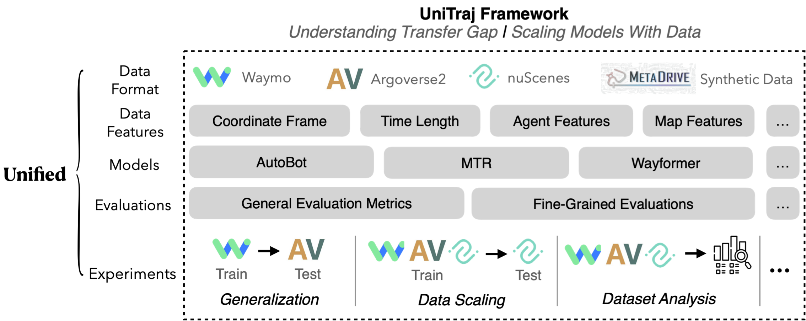

<div style="text-align: center;">
  
</div>

# UniTraj: A Unified Framework for Scalable Vehicle Trajectory Prediction

[](https://paperswithcode.com/sota/trajectory-prediction-on-nuscenes?p=unitraj-a-unified-framework-for-scalable)

[**Website**](https://vita-epfl.github.io/UniTraj/) |
[**Paper**](https://arxiv.org/pdf/2403.15098.pdf)


💡UniTraj allows users to train and evaluate trajectory prediction models from real-world datasets like Waymo, nuPlan,
nuScenes and Argoverse2 in a unified pipeline.



🔥Powered by [Hydra](https://hydra.cc/docs/intro/), [Pytorch-lightinig](https://lightning.ai/docs/pytorch/stable/),
and [WandB](https://wandb.ai/site), the framework is easy to configure, train and log.


## 📰 News & Updates

### May. 2025

- 🔥 UniTraj now supports sim agents! See more details there: [SMART](https://github.com/vita-epfl/UniTraj/tree/main/unitraj/models/smart)

### Dec. 2024
- 🔥 UniTraj now supports data selection with [TAROT](https://github.com/vita-epfl/TAROT)! Try to use less data for improved performance.

### Nov. 2024
- Adding AV2 evaluation tools.
- Using h5 format data cache for faster loader.

### Sep. 2024
- New website is live! Check it out [here](https://vita-epfl.github.io/UniTraj/).


## 🛠 Quick Start

0. Create a new conda environment

```bash
conda create -n unitraj python=3.9
conda activate unitraj
```

1. Install ScenarioNet: https://scenarionet.readthedocs.io/en/latest/install.html

2. Install Unitraj:

```bash
git clone https://github.com/vita-epfl/UniTraj.git
cd unitraj
pip install -r requirements.txt
python setup.py develop
```

You can verify the installation of UniTraj via running the training script:

```bash
python train.py method=autobot
```

The model will be trained on several sample data.

## Code Structure

There are three main components in UniTraj: dataset, model and config.
The structure of the code is as follows:

```
unitraj
├── configs
│   ├── config.yaml
│   ├── method
│   │   ├── autobot.yaml
│   │   ├── MTR.yaml
│   │   ├── wayformer.yaml
├── datasets
│   ├── base_dataset.py
│   ├── autobot_dataset.py
│   ├── wayformer_dataset.py
│   ├── MTR_dataset.py
├── models
│   ├── autobot
│   ├── mtr
│   ├── wayformer
│   ├── base_model
├── utils
```

There is a base config, dataset and model class, and each model has its own config, dataset and model class that inherit
from the base class.

## Pipeline

### 1. Data Preparation

UniTraj takes data from [ScenarioNet](https://github.com/metadriverse/scenarionet) as input. Process the data with
ScenarioNet in advance.

### 2. Configuration

UniTraj uses [Hydra](https://hydra.cc/docs/intro/) to manage configuration files.

Universal configuration file is located in `unitraj/config/config.yaml`.
Each model has its own configuration file in `unitraj/config/method/`, for
example, `unitraj/config/method/autobot.yaml`.

The configuration file is organized in a hierarchical structure, and the configuration of the model is inherited from
the universal configuration file.

#### Configuration Example

Please refer to config.yaml and method/autobot.yaml for more details.

### 2. Train

```python train.py```

### 3. Evaluation

1. In config.yaml, set the `ckpt_path` to the path of the trained model and `val_data_path` to the validation data path.
2. (Optional) In config.yaml, set eval_waymo or eval_nuscenes to True if you want to evaluate the model with Waymo or
   nuScenes official evaluation tool. (Install waymo-open-dataset and nuscenes-devkit first)
3. Run```python evaluation.py```

### 4. Dataset Analysis

```python data_analysis.py```

## Contribute to UniTraj

### Implement a new model

1. Create a new config file in `unitraj/config/` folder, for example, `unitraj/config/new_model.yaml`
2. (Optional) Create a new dataset class in `unitraj/datasets/` folder, for example, `unitraj/datasets/new_dataset.py`,
   and inherit `unitraj/dataset/base_dataset.py`
2. Create a new model class in `unitraj/model/` folder, for example, `unitraj/model/lanegcn.py`, and inherit from
   pl.LightningModule

## Dataset Structure

### Scenario Metadata

- **scenario_id**: Unique scenario ID representing a traffic scenario.

### Object Trajectories

- **obj_trajs**: Historical trajectories of objects with the following attributes:
``
[0:3] position (x, y, z)  
[3:6] size (l, w, h)
[6:11] type_onehot
[11:33] time_onehot
[33:35] heading_encoding
[35:37] vx,vy
[37:39] ax,ay
``
- **obj_trajs_mask**: Valid mask for `obj_trajs`.
- **track_index_to_predict**: Index indicating which trajectory should be used as the training sample (provided by the official dataset).
- **obj_trajs_pos**: The first 3 dimensions of `obj_trajs` representing the x, y, and z coordinates of the objects.
- **obj_trajs_last_pos**: The x, y, and z coordinates of the last frame in the historical object trajectories.

### Centered Objects

- **center_objects_world**: World coordinates of the centered objects (used as the training sample).
- **center_objects_id**: ID of the centered objects.
- **center_objects_type**: Type of centered objects:
  - 1: Vehicle
  - 2: Pedestrian
  - 3: Cyclist

### Map Information

- **map_center**: World coordinates of the map center.
- **map_polylines**: Polylines representing the map with the following attributes:
  - `[0:3]`: Position (x, y, z)
  - `[3:6]`: Direction (x, y, z)
  - `[6:9]`: Previous point position (x, y, z)
  - `[9:29]`: Lane type one-hot encoding
- **map_polylines_mask**: Valid mask for `map_polylines`.
- **map_polylines_center**: Center point of each map polyline.

### Future State Predictions

- **obj_trajs_future_state**: Future state of all the objects.
- **obj_trajs_future_mask**: Valid mask for `obj_trajs_future_state`.

### Ground Truth Data

- **center_gt_trajs**: Ground truth trajectories of centered objects, including x, y, vx, and vy coordinates.
- **center_gt_trajs_mask**: Valid mask for `center_gt_trajs`.
- **center_gt_final_valid_idx**: Final valid index of the `center_gt_trajs`.
- **center_gt_trajs_src**: Ground truth trajectories in world coordinates.

### Additional Metadata

- **dataset_name**: Name of the dataset (e.g., Waymo, AV2, nuScenes).
- **kalman_difficulty**: Kalman filter difficulty level of the centered object.
- **trajectory_type**: Type of trajectory (e.g., straight, turn right, turn left).

[//]: # (## Training on RCP)

[//]: # (0. Install runAI CLI and Kubernetes: https://wiki.rcp.epfl.ch/home/CaaS/Quick_Start)

[//]: # (1. Update the unitraj/run_rcp/wandb-secret.yaml according to the instruction: https://wiki.rcp.epfl.ch/en/home/CaaS/how-to-use-secret )

[//]: # (2. Clone the repo to RCP server, and modify the config file)

[//]: # (3. Modify the unitraj/run_rcp/train.yaml, especially configs related to file path, username, etc.)

[//]: # (3. Run the following command to train on RCP server)

[//]: # (```kubectl create -f train.yaml```)

---

### For citation:

```
@article{feng2024unitraj,
  title={UniTraj: A Unified Framework for Scalable Vehicle Trajectory Prediction},
  author={Feng, Lan and Bahari, Mohammadhossein and Amor, Kaouther Messaoud Ben and Zablocki, {\'E}loi and Cord, Matthieu and Alahi, Alexandre},
  journal={arXiv preprint arXiv:2403.15098},
  year={2024}
}

